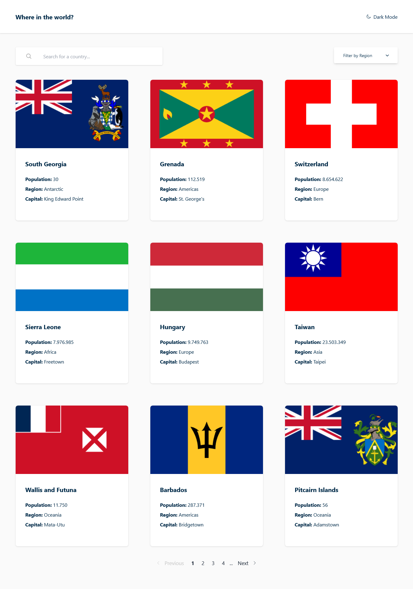
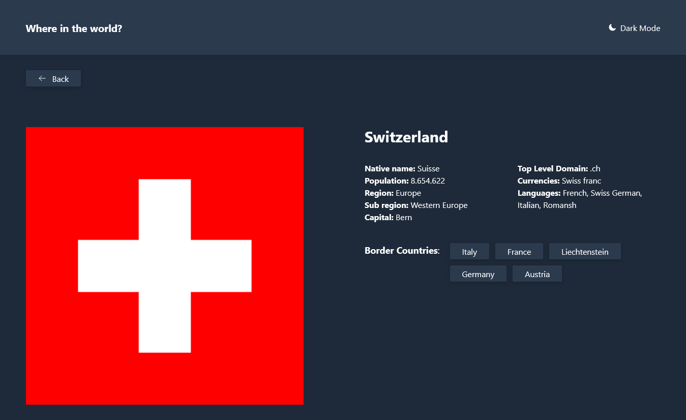

[](https://choosealicense.com/licenses/mit/) 
[](https://vitejs.dev)
[](https://vuejs.org)
[](https://tailwindcss.com)
[](https://vercel.com/docs) 
[](https://vercel.com/docs) 

# Frontend Mentor - REST Countries API with color theme switcher solution

This is a solution to the [REST Countries API with color theme switcher challenge on Frontend Mentor](https://www.frontendmentor.io/challenges/rest-countries-api-with-color-theme-switcher-5cacc469fec04111f7b848ca). Frontend Mentor challenges help you improve your coding skills by building realistic projects. 

## Table of contents

- [Overview](#overview)
  - [The challenge](#the-challenge)
  - [Screenshot](#screenshot)
  - [Links](#links)
- [My process](#my-process)
  - [Built with](#built-with)
  - [What I learned](#what-i-learned)
- [Run project](#run-project)
- [Author](#author)

## Overview

### The challenge

Users should be able to:

- See all countries from the API on the homepage
- Search for a country using an `input` field
- Filter countries by region
- Click on a country to see more detailed information on a separate page
- Click through to the border countries on the detail page
- Toggle the color scheme between light and dark mode *(optional)*

### Screenshot




### Links

- Solution URL: [GitHub](https://github.com/Jeffer-dev94/Countries-App)
- Live Site URL: [Deployed on Vercel](https://countries-app-theta-jet.vercel.app)

## My process

### Built with

- Semantic HTML5 markup
- Flexbox
- CSS Grid
- Mobile-first workflow
- [Vite](https://vitejs.dev)
- [Vue.js 3](https://vuejs.org)
- [TailwindCSS](https://tailwindcss.com)

### What I learned

Through the challenge I was able to put into practice some things that were introduced in Vue3 through the Composition API, such as `<script setup>`, composables and the store with Pinia. Having developed with Vue in its version 2 and then Vue in its version 3 but with the Options API, I obtained a slightly broader view of the Composition API. Now the next step is to participate in other challenges, putting into practice what I have learned and extending my knowledge with Setup.

## Run project
### Recommended IDE Setup

[VSCode](https://code.visualstudio.com/) + [Volar](https://marketplace.visualstudio.com/items?itemName=Vue.volar) (and disable Vetur).

### Customize configuration

See [Vite Configuration Reference](https://vitejs.dev/config/).

### Project Setup

```sh
npm install
```

#### Compile and Hot-Reload for Development

```sh
npm run dev
```

#### Compile and Minify for Production

```sh
npm run build
```

#### Lint with [ESLint](https://eslint.org/)

```sh
npm run lint
```

#### Format with [Prettier](https://prettier.io/)

```sh
npm run format
```

## Author

- GitHub - [@Jeffer-dev94](https://github.com/Jeffer-dev94)
- Frontend Mentor - [@Jeffer-dev94](https://www.frontendmentor.io/profile/Jeffer-dev94)
